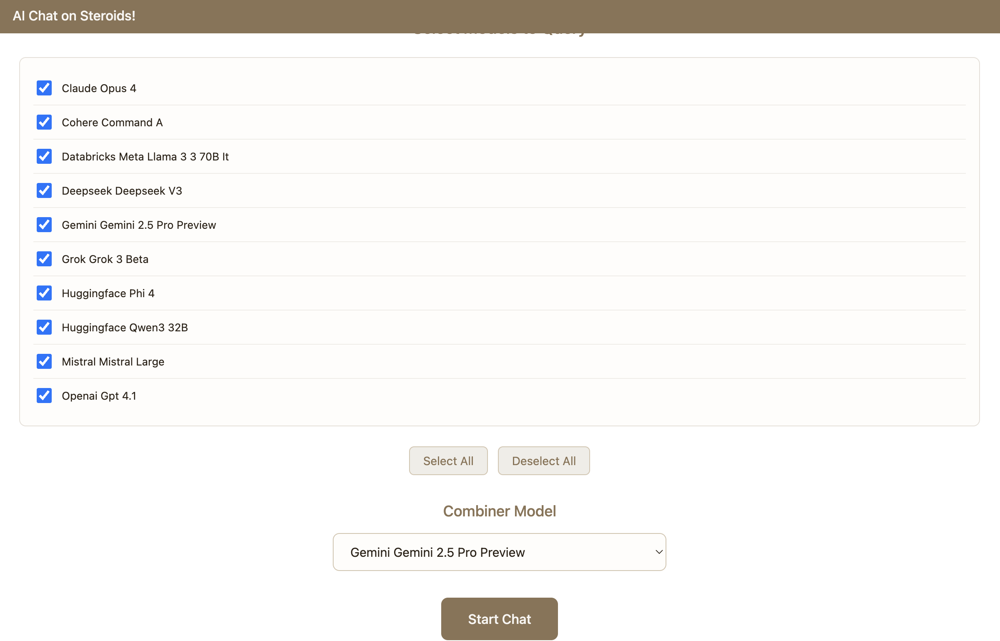
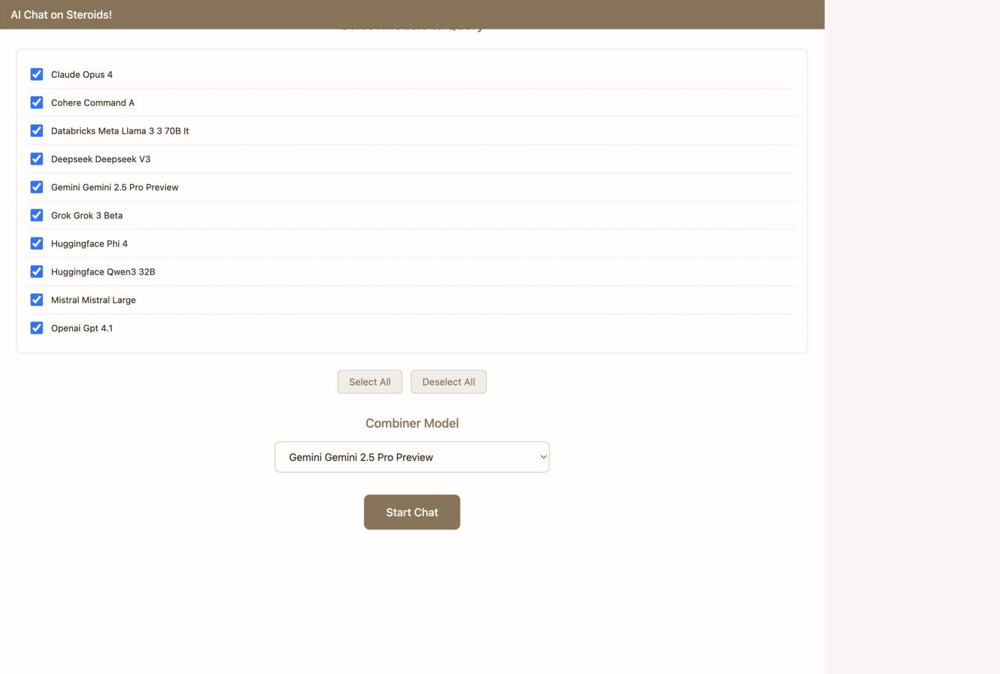

# AI Chat on Steroids! 🚀

Query multiple AI models simultaneously and get one intelligent combined response.
- Built entirely with **[Claude Code](https://www.anthropic.com/claude-code)** and **[ProxAI](https://www.proxai.co)**.
- Read blog post for the full story behind this project: **[How I Built a Multi-Model AI Chat App](https://www.proxai.co/blog/archive/multi-model-ai-chat-app)**.

<div align="center">
<strong>⭐⭐ This repo created via Vibe Coding! Zero hands-on code changes made! ⭐⭐</strong>
</div>

## What It Does

- Select from 10+ AI models (GPT, Claude, Gemini, DeepSeek, etc.)
- Ask all models the same question in parallel
- Get one smart combined answer from all responses
- Track progress in real-time

<div align="center">

</div>

## Quick Start

```bash
# Clone repository
git clone https://github.com/Nexarithm/multi_model_chat.git
cd multi_model_chat

# Create virtual environment
python3 -m venv .venv
source .venv/bin/activate

# Install
pip install proxai

# Add API keys
export OPENAI_API_KEY="your-openai-key"
export ANTHROPIC_API_KEY="your-anthropic-key"
...

# Run
python3 server.py

# Open browser
open http://localhost:3000
```

<div align="center">

</div>

## Why ProxAI?

✅ One API for 10+ AI providers
✅ No vendor lock-in
✅ Cost optimization
✅ Advanced monitoring

Learn more: [proxai.co](https://www.proxai.co)

## Pro Tip: Use ProxDash

Get better tracking and cost control with [ProxDash](https://www.proxai.co):

```bash
export PROXDASH_API_KEY="your-key"
python3 server.py
```

---

*Showcasing the future of AI-powered development with Claude Code + ProxAI*
